# nCov2019数据分析

## 数据来源

本数据来源于[2019新型冠状病毒疫情时间序列数据仓库](https://github.com/BlankerL/DXY-2019-nCoV-Data)，其数据来源为[丁香园](https://3g.dxy.cn/newh5/view/pneumonia)。


```python
%matplotlib inline

import pandas as pd
import numpy as np
import matplotlib.pyplot as plt
import data_util
import plot_util

from IPython.display import display, Markdown
```


```python
city_name = '深圳'
```


```python
display(Markdown('## ' + city_name + '数据'))
```


## 深圳数据


```python
raw_data = data_util.load_data()
```


```python
display(Markdown('### ' + city_name + '累计数量'))
```


### 深圳累计数量


```python

city_daily_data = data_util.aggregate_daily(raw_data, city_name)
city_daily_data = data_util.calculate_dead_cured_rate(city_daily_data)
city_daily_data.tail(5)
```


<div>
<style scoped>
    .dataframe tbody tr th:only-of-type {
        vertical-align: middle;
    }

    .dataframe tbody tr th {
        vertical-align: top;
    }

    .dataframe thead th {
        text-align: right;
    }
</style>
<table border="1" class="dataframe">
  <thead>
    <tr style="text-align: right;">
      <th></th>
      <th>provinceName</th>
      <th>cityName</th>
      <th>confirmed</th>
      <th>suspected</th>
      <th>cured</th>
      <th>dead</th>
      <th>updateTime</th>
      <th>updateDate</th>
      <th>dead_rate</th>
      <th>cured_rate</th>
    </tr>
  </thead>
  <tbody>
    <tr>
      <td>7213</td>
      <td>广东省</td>
      <td>深圳</td>
      <td>354</td>
      <td>0</td>
      <td>39</td>
      <td>0</td>
      <td>2020-02-08 19:46:49.463</td>
      <td>2020-02-08</td>
      <td>0.0</td>
      <td>11.016949</td>
    </tr>
    <tr>
      <td>4102</td>
      <td>广东省</td>
      <td>深圳</td>
      <td>366</td>
      <td>0</td>
      <td>46</td>
      <td>0</td>
      <td>2020-02-09 23:00:53.855</td>
      <td>2020-02-09</td>
      <td>0.0</td>
      <td>12.568306</td>
    </tr>
    <tr>
      <td>2495</td>
      <td>广东省</td>
      <td>深圳</td>
      <td>369</td>
      <td>0</td>
      <td>56</td>
      <td>0</td>
      <td>2020-02-10 21:36:08.643</td>
      <td>2020-02-10</td>
      <td>0.0</td>
      <td>15.176152</td>
    </tr>
    <tr>
      <td>540</td>
      <td>广东省</td>
      <td>深圳</td>
      <td>375</td>
      <td>0</td>
      <td>66</td>
      <td>0</td>
      <td>2020-02-11 21:55:20.587</td>
      <td>2020-02-11</td>
      <td>0.0</td>
      <td>17.600000</td>
    </tr>
    <tr>
      <td>67</td>
      <td>广东省</td>
      <td>深圳</td>
      <td>386</td>
      <td>0</td>
      <td>66</td>
      <td>0</td>
      <td>2020-02-12 09:33:11.975</td>
      <td>2020-02-12</td>
      <td>0.0</td>
      <td>17.098446</td>
    </tr>
  </tbody>
</table>
</div>


```python
figure = plot_util.plot_conf_main(city_daily_data, city_name + '累计')
```


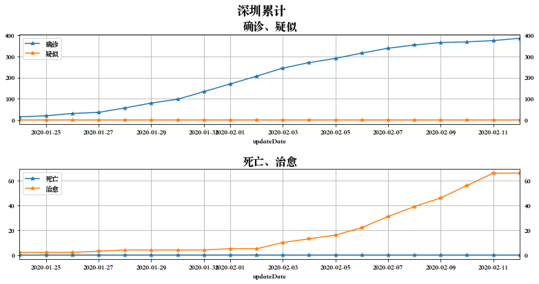


```python
display(Markdown('### ' + city_name + '增长速度'))
```


### 深圳增长速度


```python
city_daily_data_1st_derivative = data_util.diff(city_daily_data)
city_daily_data_1st_derivative.tail()
```


<div>
<style scoped>
    .dataframe tbody tr th:only-of-type {
        vertical-align: middle;
    }

    .dataframe tbody tr th {
        vertical-align: top;
    }

    .dataframe thead th {
        text-align: right;
    }
</style>
<table border="1" class="dataframe">
  <thead>
    <tr style="text-align: right;">
      <th></th>
      <th>provinceName</th>
      <th>cityName</th>
      <th>confirmed</th>
      <th>suspected</th>
      <th>cured</th>
      <th>dead</th>
      <th>updateTime</th>
      <th>updateDate</th>
      <th>dead_rate</th>
      <th>cured_rate</th>
    </tr>
  </thead>
  <tbody>
    <tr>
      <td>7213</td>
      <td>广东省</td>
      <td>深圳</td>
      <td>15.0</td>
      <td>0.0</td>
      <td>8.0</td>
      <td>0.0</td>
      <td>2020-02-08 19:46:49.463</td>
      <td>2020-02-08</td>
      <td>0.0</td>
      <td>1.872406</td>
    </tr>
    <tr>
      <td>4102</td>
      <td>广东省</td>
      <td>深圳</td>
      <td>12.0</td>
      <td>0.0</td>
      <td>7.0</td>
      <td>0.0</td>
      <td>2020-02-09 23:00:53.855</td>
      <td>2020-02-09</td>
      <td>0.0</td>
      <td>1.551357</td>
    </tr>
    <tr>
      <td>2495</td>
      <td>广东省</td>
      <td>深圳</td>
      <td>3.0</td>
      <td>0.0</td>
      <td>10.0</td>
      <td>0.0</td>
      <td>2020-02-10 21:36:08.643</td>
      <td>2020-02-10</td>
      <td>0.0</td>
      <td>2.607846</td>
    </tr>
    <tr>
      <td>540</td>
      <td>广东省</td>
      <td>深圳</td>
      <td>6.0</td>
      <td>0.0</td>
      <td>10.0</td>
      <td>0.0</td>
      <td>2020-02-11 21:55:20.587</td>
      <td>2020-02-11</td>
      <td>0.0</td>
      <td>2.423848</td>
    </tr>
    <tr>
      <td>67</td>
      <td>广东省</td>
      <td>深圳</td>
      <td>11.0</td>
      <td>0.0</td>
      <td>0.0</td>
      <td>0.0</td>
      <td>2020-02-12 09:33:11.975</td>
      <td>2020-02-12</td>
      <td>0.0</td>
      <td>-0.501554</td>
    </tr>
  </tbody>
</table>
</div>


```python
figure = plot_util.plot_conf_main(city_daily_data_1st_derivative, city_name + '增长速度')
```


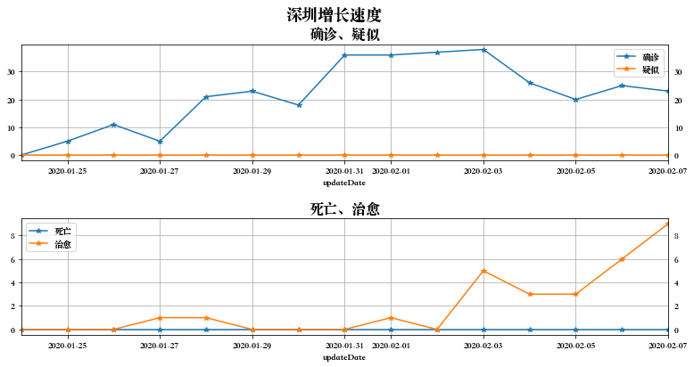


```python
display(Markdown('### ' + city_name + '增长加速度'))
```


### 深圳增长加速度


```python
city_daily_data_2nd_derivative = data_util.diff(city_daily_data_1st_derivative)
city_daily_data_2nd_derivative.tail()
```


<div>
<style scoped>
    .dataframe tbody tr th:only-of-type {
        vertical-align: middle;
    }

    .dataframe tbody tr th {
        vertical-align: top;
    }

    .dataframe thead th {
        text-align: right;
    }
</style>
<table border="1" class="dataframe">
  <thead>
    <tr style="text-align: right;">
      <th></th>
      <th>provinceName</th>
      <th>cityName</th>
      <th>confirmed</th>
      <th>suspected</th>
      <th>cured</th>
      <th>dead</th>
      <th>updateTime</th>
      <th>updateDate</th>
      <th>dead_rate</th>
      <th>cured_rate</th>
    </tr>
  </thead>
  <tbody>
    <tr>
      <td>7213</td>
      <td>广东省</td>
      <td>深圳</td>
      <td>-8.0</td>
      <td>0.0</td>
      <td>-1.0</td>
      <td>0.0</td>
      <td>2020-02-08 19:46:49.463</td>
      <td>2020-02-08</td>
      <td>0.0</td>
      <td>-0.310111</td>
    </tr>
    <tr>
      <td>4102</td>
      <td>广东省</td>
      <td>深圳</td>
      <td>-3.0</td>
      <td>0.0</td>
      <td>-1.0</td>
      <td>0.0</td>
      <td>2020-02-09 23:00:53.855</td>
      <td>2020-02-09</td>
      <td>0.0</td>
      <td>-0.321050</td>
    </tr>
    <tr>
      <td>2495</td>
      <td>广东省</td>
      <td>深圳</td>
      <td>-9.0</td>
      <td>0.0</td>
      <td>3.0</td>
      <td>0.0</td>
      <td>2020-02-10 21:36:08.643</td>
      <td>2020-02-10</td>
      <td>0.0</td>
      <td>1.056489</td>
    </tr>
    <tr>
      <td>540</td>
      <td>广东省</td>
      <td>深圳</td>
      <td>3.0</td>
      <td>0.0</td>
      <td>0.0</td>
      <td>0.0</td>
      <td>2020-02-11 21:55:20.587</td>
      <td>2020-02-11</td>
      <td>0.0</td>
      <td>-0.183998</td>
    </tr>
    <tr>
      <td>67</td>
      <td>广东省</td>
      <td>深圳</td>
      <td>5.0</td>
      <td>0.0</td>
      <td>-10.0</td>
      <td>0.0</td>
      <td>2020-02-12 09:33:11.975</td>
      <td>2020-02-12</td>
      <td>0.0</td>
      <td>-2.925403</td>
    </tr>
  </tbody>
</table>
</div>


```python
figure = plot_util.plot_conf_main(city_daily_data_2nd_derivative, city_name + '增长加速度')
```

    /Library/Frameworks/Python.framework/Versions/3.7/lib/python3.7/site-packages/matplotlib/backends/backend_agg.py:211: RuntimeWarning: Glyph 8722 missing from current font.
      font.set_text(s, 0.0, flags=flags)
    /Library/Frameworks/Python.framework/Versions/3.7/lib/python3.7/site-packages/matplotlib/backends/backend_agg.py:180: RuntimeWarning: Glyph 8722 missing from current font.
      font.set_text(s, 0, flags=flags)


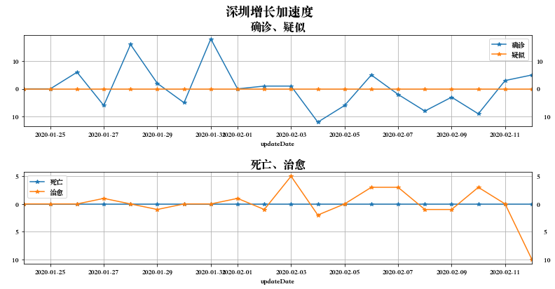


```python
display(Markdown('### ' + city_name + '死亡治愈率'))
```


### 深圳死亡治愈率


```python
figure = plot_util.plot_conf_dead_cured_ratio(city_daily_data, city_name + '死亡治愈率%')
```


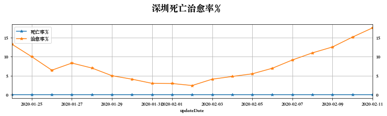


```python
black_province_name = '湖北省'
```


```python
display(Markdown('## 全国数据（除' + black_province_name + '）'))
```


## 全国数据（除湖北省）


```python
display(Markdown('因' + black_province_name + '灾情特别严重且现已隔离（' + black_province_name + '加油），它的数据可能和全国其他地区有较大差别。为更精确预计其他地区的未来发展趋势，这里考虑排除其以外的全国其他地区情况。'))
```


因湖北省灾情特别严重且现已隔离（湖北省加油），它的数据可能和全国其他地区有较大差别。为更精确预计其他地区的未来发展趋势，这里考虑排除其以外的全国其他地区情况。


```python
display(Markdown('## 全国累计（除' + black_province_name + '）'))
```


## 全国累计（除湖北省）


```python
white_daily_data = data_util.aggregate_daily_except(raw_data, province_name=black_province_name)
white_daily_data = data_util.calculate_dead_cured_rate(white_daily_data)
```


```python
figure = plot_util.plot_conf_main(white_daily_data, '全国累计（除' + black_province_name + '）')
```


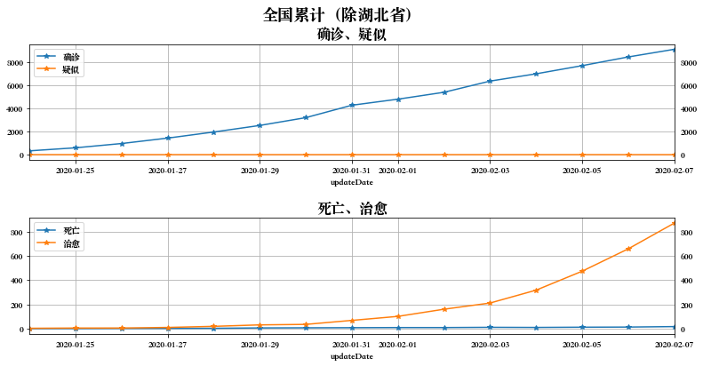


```python
display(Markdown('## 全国增长速度（除' + black_province_name + '）'))
```


## 全国增长速度（除湖北省）


```python
white_daily_data_1st_derivative = data_util.diff(white_daily_data)
white_daily_data_1st_derivative.tail()
```


<div>
<style scoped>
    .dataframe tbody tr th:only-of-type {
        vertical-align: middle;
    }

    .dataframe tbody tr th {
        vertical-align: top;
    }

    .dataframe thead th {
        text-align: right;
    }
</style>
<table border="1" class="dataframe">
  <thead>
    <tr style="text-align: right;">
      <th></th>
      <th>confirmed</th>
      <th>suspected</th>
      <th>cured</th>
      <th>dead</th>
      <th>dead_rate</th>
      <th>cured_rate</th>
    </tr>
    <tr>
      <th>updateDate</th>
      <th></th>
      <th></th>
      <th></th>
      <th></th>
      <th></th>
      <th></th>
    </tr>
  </thead>
  <tbody>
    <tr>
      <td>2020-02-08</td>
      <td>558.0</td>
      <td>0.0</td>
      <td>248.0</td>
      <td>7.0</td>
      <td>0.061106</td>
      <td>2.017085</td>
    </tr>
    <tr>
      <td>2020-02-09</td>
      <td>466.0</td>
      <td>0.0</td>
      <td>267.0</td>
      <td>3.0</td>
      <td>0.017723</td>
      <td>2.106149</td>
    </tr>
    <tr>
      <td>2020-02-10</td>
      <td>433.0</td>
      <td>0.0</td>
      <td>264.0</td>
      <td>7.0</td>
      <td>0.055008</td>
      <td>1.941016</td>
    </tr>
    <tr>
      <td>2020-02-11</td>
      <td>337.0</td>
      <td>0.0</td>
      <td>277.0</td>
      <td>2.0</td>
      <td>0.008100</td>
      <td>2.061066</td>
    </tr>
    <tr>
      <td>2020-02-12</td>
      <td>-332.0</td>
      <td>0.0</td>
      <td>-19.0</td>
      <td>0.0</td>
      <td>0.010698</td>
      <td>0.376790</td>
    </tr>
  </tbody>
</table>
</div>


```python
figure = plot_util.plot_conf_main(white_daily_data_1st_derivative, '全国增长速度（除' + black_province_name + '）')
```


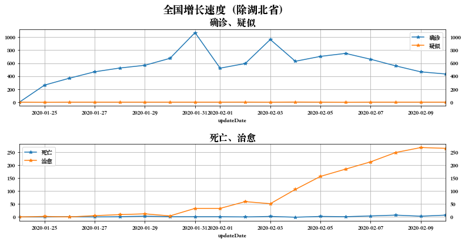


```python
display(Markdown('## 全国增长加速度（除' + black_province_name + '）'))
```


## 全国增长加速度（除湖北省）


```python
white_daily_data_2nd_derivative = data_util.diff(white_daily_data_1st_derivative)
white_daily_data_2nd_derivative.tail()
```


<div>
<style scoped>
    .dataframe tbody tr th:only-of-type {
        vertical-align: middle;
    }

    .dataframe tbody tr th {
        vertical-align: top;
    }

    .dataframe thead th {
        text-align: right;
    }
</style>
<table border="1" class="dataframe">
  <thead>
    <tr style="text-align: right;">
      <th></th>
      <th>confirmed</th>
      <th>suspected</th>
      <th>cured</th>
      <th>dead</th>
      <th>dead_rate</th>
      <th>cured_rate</th>
    </tr>
    <tr>
      <th>updateDate</th>
      <th></th>
      <th></th>
      <th></th>
      <th></th>
      <th></th>
      <th></th>
    </tr>
  </thead>
  <tbody>
    <tr>
      <td>2020-02-08</td>
      <td>-102.0</td>
      <td>0.0</td>
      <td>36.0</td>
      <td>3.0</td>
      <td>0.029158</td>
      <td>0.251458</td>
    </tr>
    <tr>
      <td>2020-02-09</td>
      <td>-92.0</td>
      <td>0.0</td>
      <td>19.0</td>
      <td>-4.0</td>
      <td>-0.043383</td>
      <td>0.089064</td>
    </tr>
    <tr>
      <td>2020-02-10</td>
      <td>-33.0</td>
      <td>0.0</td>
      <td>-3.0</td>
      <td>4.0</td>
      <td>0.037285</td>
      <td>-0.165132</td>
    </tr>
    <tr>
      <td>2020-02-11</td>
      <td>-96.0</td>
      <td>0.0</td>
      <td>13.0</td>
      <td>-5.0</td>
      <td>-0.046908</td>
      <td>0.120049</td>
    </tr>
    <tr>
      <td>2020-02-12</td>
      <td>-669.0</td>
      <td>0.0</td>
      <td>-296.0</td>
      <td>-2.0</td>
      <td>0.002597</td>
      <td>-1.684276</td>
    </tr>
  </tbody>
</table>
</div>


```python
figure = plot_util.plot_conf_main(white_daily_data_2nd_derivative, '全国增长加速度（除' + black_province_name + '）')
```


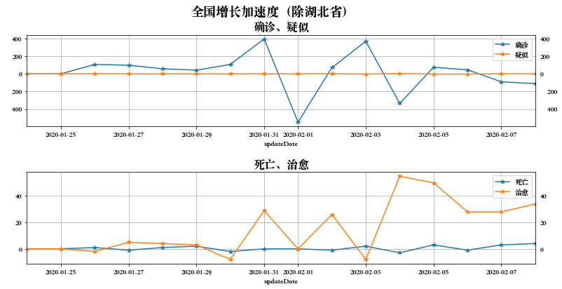


```python
display(Markdown('## 全国增死亡治愈率（除' + black_province_name + '）'))
```


## 全国增死亡治愈率（除湖北省）


```python
figure = plot_util.plot_conf_dead_cured_ratio(white_daily_data, '全国增死亡治愈率%（除' + black_province_name + '）')
```


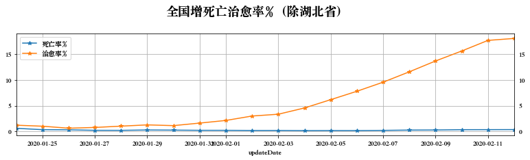


```python
city_name = '武汉'
```


```python
display(Markdown('## ' + city_name + '数据'))
```


## 武汉数据


```python
raw_data = data_util.load_data()
```


```python
display(Markdown('### ' + city_name + '累计数量'))
```


### 武汉累计数量


```python
city_daily_data = data_util.aggregate_daily(raw_data, city_name)
city_daily_data = data_util.calculate_dead_cured_rate(city_daily_data)
city_daily_data.tail(5)
```


<div>
<style scoped>
    .dataframe tbody tr th:only-of-type {
        vertical-align: middle;
    }

    .dataframe tbody tr th {
        vertical-align: top;
    }

    .dataframe thead th {
        text-align: right;
    }
</style>
<table border="1" class="dataframe">
  <thead>
    <tr style="text-align: right;">
      <th></th>
      <th>provinceName</th>
      <th>cityName</th>
      <th>confirmed</th>
      <th>suspected</th>
      <th>cured</th>
      <th>dead</th>
      <th>updateTime</th>
      <th>updateDate</th>
      <th>dead_rate</th>
      <th>cured_rate</th>
    </tr>
  </thead>
  <tbody>
    <tr>
      <td>7033</td>
      <td>湖北省</td>
      <td>武汉</td>
      <td>13603</td>
      <td>0</td>
      <td>747</td>
      <td>545</td>
      <td>2020-02-08 22:02:50.042</td>
      <td>2020-02-08</td>
      <td>4.006469</td>
      <td>5.491436</td>
    </tr>
    <tr>
      <td>4544</td>
      <td>湖北省</td>
      <td>武汉</td>
      <td>14982</td>
      <td>0</td>
      <td>878</td>
      <td>608</td>
      <td>2020-02-09 19:09:33.896</td>
      <td>2020-02-09</td>
      <td>4.058203</td>
      <td>5.860366</td>
    </tr>
    <tr>
      <td>2516</td>
      <td>湖北省</td>
      <td>武汉</td>
      <td>16902</td>
      <td>0</td>
      <td>1046</td>
      <td>681</td>
      <td>2020-02-10 21:30:02.904</td>
      <td>2020-02-10</td>
      <td>4.029109</td>
      <td>6.188617</td>
    </tr>
    <tr>
      <td>523</td>
      <td>湖北省</td>
      <td>武汉</td>
      <td>18454</td>
      <td>0</td>
      <td>1242</td>
      <td>748</td>
      <td>2020-02-11 21:55:20.587</td>
      <td>2020-02-11</td>
      <td>4.053322</td>
      <td>6.730248</td>
    </tr>
    <tr>
      <td>422</td>
      <td>湖北省</td>
      <td>武汉</td>
      <td>19558</td>
      <td>0</td>
      <td>1378</td>
      <td>820</td>
      <td>2020-02-12 07:26:53.133</td>
      <td>2020-02-12</td>
      <td>4.192658</td>
      <td>7.045710</td>
    </tr>
  </tbody>
</table>
</div>


```python
figure = plot_util.plot_conf_main(city_daily_data, city_name + '累计')
```


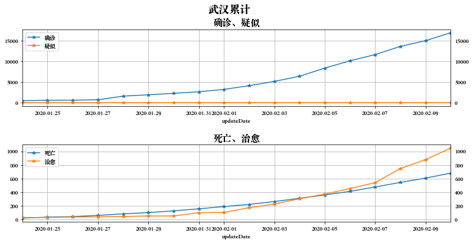


```python
display(Markdown('### ' + city_name + '增长速度'))
```


### 武汉增长速度


```python
city_daily_data_1st_derivative = data_util.diff(city_daily_data)
city_daily_data_1st_derivative.tail()
```


<div>
<style scoped>
    .dataframe tbody tr th:only-of-type {
        vertical-align: middle;
    }

    .dataframe tbody tr th {
        vertical-align: top;
    }

    .dataframe thead th {
        text-align: right;
    }
</style>
<table border="1" class="dataframe">
  <thead>
    <tr style="text-align: right;">
      <th></th>
      <th>provinceName</th>
      <th>cityName</th>
      <th>confirmed</th>
      <th>suspected</th>
      <th>cured</th>
      <th>dead</th>
      <th>updateTime</th>
      <th>updateDate</th>
      <th>dead_rate</th>
      <th>cured_rate</th>
    </tr>
  </thead>
  <tbody>
    <tr>
      <td>7033</td>
      <td>湖北省</td>
      <td>武汉</td>
      <td>1985.0</td>
      <td>0.0</td>
      <td>205.0</td>
      <td>67.0</td>
      <td>2020-02-08 22:02:50.042</td>
      <td>2020-02-08</td>
      <td>-0.107836</td>
      <td>0.826261</td>
    </tr>
    <tr>
      <td>4544</td>
      <td>湖北省</td>
      <td>武汉</td>
      <td>1379.0</td>
      <td>0.0</td>
      <td>131.0</td>
      <td>63.0</td>
      <td>2020-02-09 19:09:33.896</td>
      <td>2020-02-09</td>
      <td>0.051734</td>
      <td>0.368930</td>
    </tr>
    <tr>
      <td>2516</td>
      <td>湖北省</td>
      <td>武汉</td>
      <td>1920.0</td>
      <td>0.0</td>
      <td>168.0</td>
      <td>73.0</td>
      <td>2020-02-10 21:30:02.904</td>
      <td>2020-02-10</td>
      <td>-0.029094</td>
      <td>0.328251</td>
    </tr>
    <tr>
      <td>523</td>
      <td>湖北省</td>
      <td>武汉</td>
      <td>1552.0</td>
      <td>0.0</td>
      <td>196.0</td>
      <td>67.0</td>
      <td>2020-02-11 21:55:20.587</td>
      <td>2020-02-11</td>
      <td>0.024213</td>
      <td>0.541631</td>
    </tr>
    <tr>
      <td>422</td>
      <td>湖北省</td>
      <td>武汉</td>
      <td>1104.0</td>
      <td>0.0</td>
      <td>136.0</td>
      <td>72.0</td>
      <td>2020-02-12 07:26:53.133</td>
      <td>2020-02-12</td>
      <td>0.139336</td>
      <td>0.315462</td>
    </tr>
  </tbody>
</table>
</div>


```python
figure = plot_util.plot_conf_main(city_daily_data_1st_derivative, city_name + '增长速度')
```


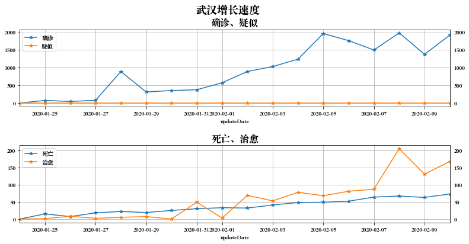


```python
display(Markdown('### ' + city_name + '增长加速度'))
```


### 武汉增长加速度


```python
city_daily_data_2nd_derivative = data_util.diff(city_daily_data_1st_derivative)
city_daily_data_2nd_derivative.tail()
```


<div>
<style scoped>
    .dataframe tbody tr th:only-of-type {
        vertical-align: middle;
    }

    .dataframe tbody tr th {
        vertical-align: top;
    }

    .dataframe thead th {
        text-align: right;
    }
</style>
<table border="1" class="dataframe">
  <thead>
    <tr style="text-align: right;">
      <th></th>
      <th>provinceName</th>
      <th>cityName</th>
      <th>confirmed</th>
      <th>suspected</th>
      <th>cured</th>
      <th>dead</th>
      <th>updateTime</th>
      <th>updateDate</th>
      <th>dead_rate</th>
      <th>cured_rate</th>
    </tr>
  </thead>
  <tbody>
    <tr>
      <td>7033</td>
      <td>湖北省</td>
      <td>武汉</td>
      <td>484.0</td>
      <td>0.0</td>
      <td>118.0</td>
      <td>3.0</td>
      <td>2020-02-08 22:02:50.042</td>
      <td>2020-02-08</td>
      <td>-0.130019</td>
      <td>0.658467</td>
    </tr>
    <tr>
      <td>4544</td>
      <td>湖北省</td>
      <td>武汉</td>
      <td>-606.0</td>
      <td>0.0</td>
      <td>-74.0</td>
      <td>-4.0</td>
      <td>2020-02-09 19:09:33.896</td>
      <td>2020-02-09</td>
      <td>0.159570</td>
      <td>-0.457331</td>
    </tr>
    <tr>
      <td>2516</td>
      <td>湖北省</td>
      <td>武汉</td>
      <td>541.0</td>
      <td>0.0</td>
      <td>37.0</td>
      <td>10.0</td>
      <td>2020-02-10 21:30:02.904</td>
      <td>2020-02-10</td>
      <td>-0.080828</td>
      <td>-0.040679</td>
    </tr>
    <tr>
      <td>523</td>
      <td>湖北省</td>
      <td>武汉</td>
      <td>-368.0</td>
      <td>0.0</td>
      <td>28.0</td>
      <td>-6.0</td>
      <td>2020-02-11 21:55:20.587</td>
      <td>2020-02-11</td>
      <td>0.053307</td>
      <td>0.213380</td>
    </tr>
    <tr>
      <td>422</td>
      <td>湖北省</td>
      <td>武汉</td>
      <td>-448.0</td>
      <td>0.0</td>
      <td>-60.0</td>
      <td>5.0</td>
      <td>2020-02-12 07:26:53.133</td>
      <td>2020-02-12</td>
      <td>0.115123</td>
      <td>-0.226169</td>
    </tr>
  </tbody>
</table>
</div>


```python
figure = plot_util.plot_conf_main(city_daily_data_2nd_derivative, city_name + '增长加速度')
```


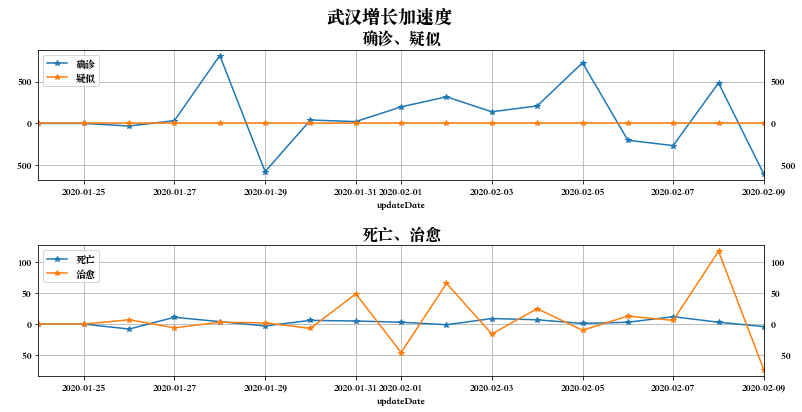


```python
display(Markdown('### ' + city_name + '死亡治愈率'))
```


### 武汉死亡治愈率


```python
figure = plot_util.plot_conf_dead_cured_ratio(city_daily_data, city_name + '死亡治愈率%')
```


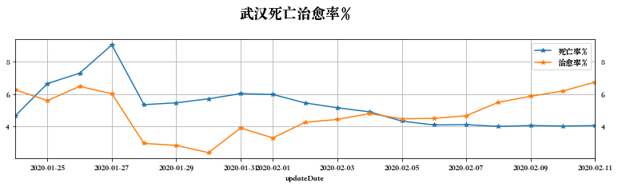

