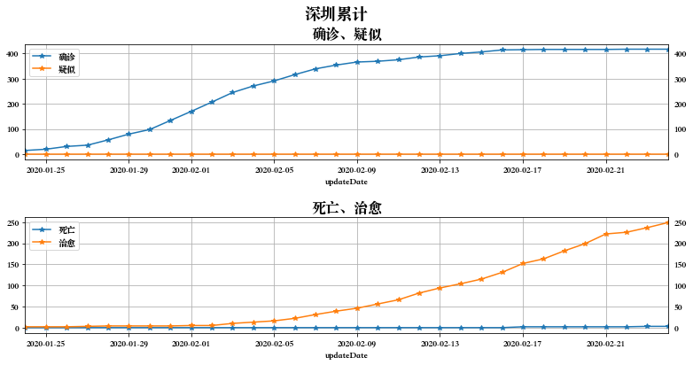
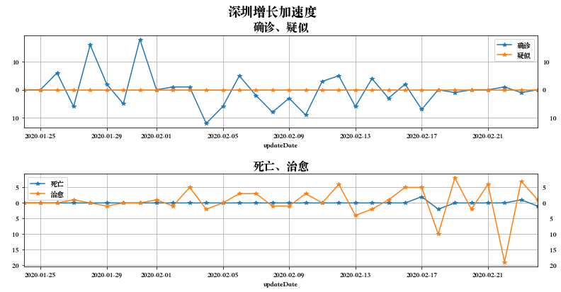
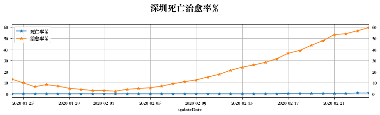
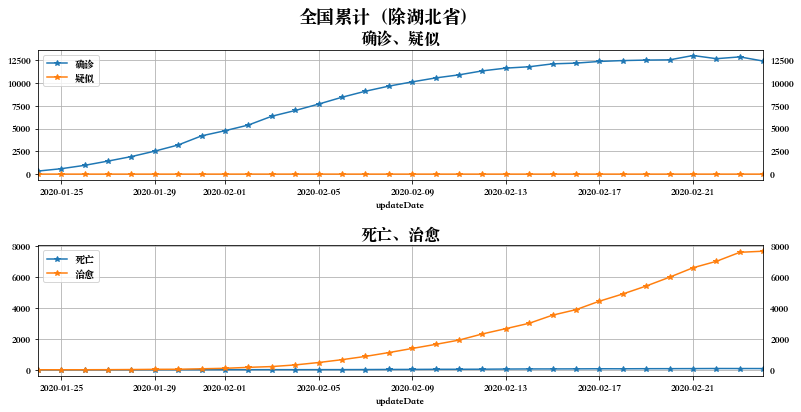
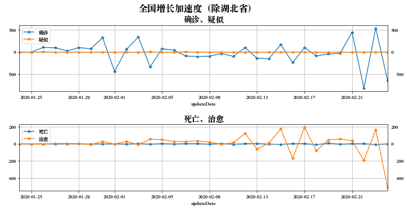
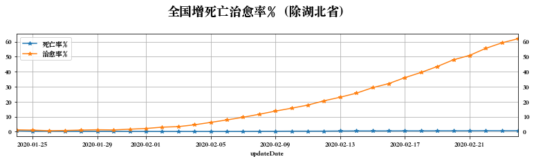
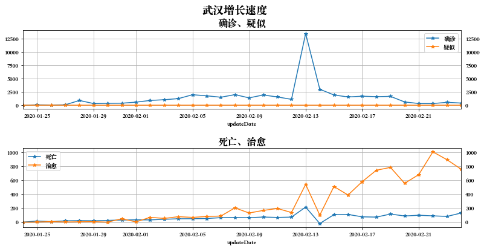
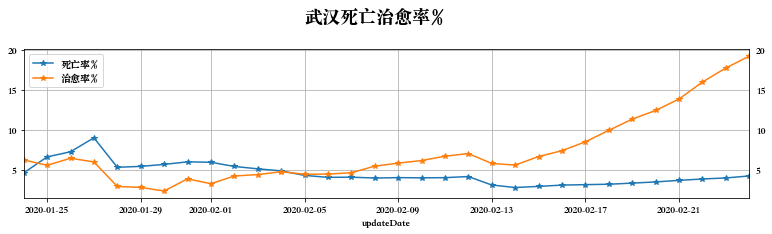

# nCov2019数据分析

## 数据来源

本数据来源于[2019新型冠状病毒疫情时间序列数据仓库](https://github.com/BlankerL/DXY-2019-nCoV-Data)，其数据来源为[丁香园](https://3g.dxy.cn/newh5/view/pneumonia)。


```python
%matplotlib inline

import pandas as pd
import numpy as np
import matplotlib.pyplot as plt
import data_util
import plot_util

from IPython.display import display, Markdown
```


```python
raw_data = data_util.load_data()
```

## 全国数据校验

全国数据是数值较大、自然增长、概率分布、应不受人为干预的数据，所以它应该满足[本福特定律](https://baike.baidu.com/item/本福特定律)（Benford's Law, First-Digit Law），即数据首位数字越小它出现概率越高。比如首位数字是1的概率比9高很多。

本福特定律只是数据真实的必要不充分条件，如果只公布部分数据，且已公布数据也恰好符合上面条件，则可以规避开本数据校验。


```python
raw_city_confirmed = raw_data['city_confirmedCount']

benford_raw = data_util.benford(raw_city_confirmed)
figure = plot_util.plot_bar(benford_raw, '全国数据校验（本福特定律）', 'Digit', 'Percent')
```


```python
city_name = '深圳'
```


```python
display(Markdown('## ' + city_name + '数据'))
```


## 深圳数据


```python
raw_data = data_util.load_data()
```


```python
display(Markdown('### ' + city_name + '累计数量'))
```


### 深圳累计数量


```python

city_daily_data = data_util.aggregate_daily(raw_data, city_name)
city_daily_data = data_util.calculate_dead_cured_rate(city_daily_data)
city_daily_data.tail(5)
```


<div>
<style scoped>
    .dataframe tbody tr th:only-of-type {
        vertical-align: middle;
    }

    .dataframe tbody tr th {
        vertical-align: top;
    }

    .dataframe thead th {
        text-align: right;
    }
</style>
<table border="1" class="dataframe">
  <thead>
    <tr style="text-align: right;">
      <th></th>
      <th>provinceName</th>
      <th>provinceEnglishName</th>
      <th>province_zipCode</th>
      <th>cityName</th>
      <th>cityEnglishName</th>
      <th>city_zipCode</th>
      <th>confirmed</th>
      <th>suspected</th>
      <th>cured</th>
      <th>dead</th>
      <th>updateTime</th>
      <th>updateDate</th>
      <th>dead_rate</th>
      <th>cured_rate</th>
    </tr>
  </thead>
  <tbody>
    <tr>
      <td>5580</td>
      <td>广东省</td>
      <td>Guangdong</td>
      <td>440000</td>
      <td>深圳</td>
      <td>Shenzhen</td>
      <td>440300.0</td>
      <td>416</td>
      <td>0</td>
      <td>199</td>
      <td>2</td>
      <td>2020-02-20 19:07:19.834</td>
      <td>2020-02-20</td>
      <td>0.480769</td>
      <td>47.836538</td>
    </tr>
    <tr>
      <td>4495</td>
      <td>广东省</td>
      <td>Guangdong</td>
      <td>440000</td>
      <td>深圳</td>
      <td>Shenzhen</td>
      <td>440300.0</td>
      <td>416</td>
      <td>0</td>
      <td>222</td>
      <td>2</td>
      <td>2020-02-21 18:12:13.066</td>
      <td>2020-02-21</td>
      <td>0.480769</td>
      <td>53.365385</td>
    </tr>
    <tr>
      <td>2753</td>
      <td>广东省</td>
      <td>Guangdong</td>
      <td>440000</td>
      <td>深圳</td>
      <td>Shenzhen</td>
      <td>440300.0</td>
      <td>417</td>
      <td>0</td>
      <td>226</td>
      <td>2</td>
      <td>2020-02-22 18:01:40.406</td>
      <td>2020-02-22</td>
      <td>0.479616</td>
      <td>54.196643</td>
    </tr>
    <tr>
      <td>1065</td>
      <td>广东省</td>
      <td>Guangdong</td>
      <td>440000</td>
      <td>深圳</td>
      <td>Shenzhen</td>
      <td>440300.0</td>
      <td>417</td>
      <td>0</td>
      <td>237</td>
      <td>3</td>
      <td>2020-02-23 19:19:02.938</td>
      <td>2020-02-23</td>
      <td>0.719424</td>
      <td>56.834532</td>
    </tr>
    <tr>
      <td>32</td>
      <td>广东省</td>
      <td>Guangdong</td>
      <td>440000</td>
      <td>深圳</td>
      <td>Shenzhen</td>
      <td>440300.0</td>
      <td>417</td>
      <td>0</td>
      <td>249</td>
      <td>3</td>
      <td>2020-02-24 18:16:54.754</td>
      <td>2020-02-24</td>
      <td>0.719424</td>
      <td>59.712230</td>
    </tr>
  </tbody>
</table>
</div>


```python
figure = plot_util.plot_conf_main(city_daily_data, city_name + '累计')
```





```python
display(Markdown('### ' + city_name + '增长速度'))
```


### 深圳增长速度


```python
city_daily_data_1st_derivative = data_util.diff(city_daily_data)
city_daily_data_1st_derivative.tail()
```


<div>
<style scoped>
    .dataframe tbody tr th:only-of-type {
        vertical-align: middle;
    }

    .dataframe tbody tr th {
        vertical-align: top;
    }

    .dataframe thead th {
        text-align: right;
    }
</style>
<table border="1" class="dataframe">
  <thead>
    <tr style="text-align: right;">
      <th></th>
      <th>provinceName</th>
      <th>provinceEnglishName</th>
      <th>province_zipCode</th>
      <th>cityName</th>
      <th>cityEnglishName</th>
      <th>city_zipCode</th>
      <th>confirmed</th>
      <th>suspected</th>
      <th>cured</th>
      <th>dead</th>
      <th>updateTime</th>
      <th>updateDate</th>
      <th>dead_rate</th>
      <th>cured_rate</th>
    </tr>
  </thead>
  <tbody>
    <tr>
      <td>5580</td>
      <td>广东省</td>
      <td>Guangdong</td>
      <td>440000</td>
      <td>深圳</td>
      <td>Shenzhen</td>
      <td>440300.0</td>
      <td>0.0</td>
      <td>0.0</td>
      <td>17.0</td>
      <td>0.0</td>
      <td>2020-02-20 19:07:19.834</td>
      <td>2020-02-20</td>
      <td>0.000000</td>
      <td>4.086538</td>
    </tr>
    <tr>
      <td>4495</td>
      <td>广东省</td>
      <td>Guangdong</td>
      <td>440000</td>
      <td>深圳</td>
      <td>Shenzhen</td>
      <td>440300.0</td>
      <td>0.0</td>
      <td>0.0</td>
      <td>23.0</td>
      <td>0.0</td>
      <td>2020-02-21 18:12:13.066</td>
      <td>2020-02-21</td>
      <td>0.000000</td>
      <td>5.528846</td>
    </tr>
    <tr>
      <td>2753</td>
      <td>广东省</td>
      <td>Guangdong</td>
      <td>440000</td>
      <td>深圳</td>
      <td>Shenzhen</td>
      <td>440300.0</td>
      <td>1.0</td>
      <td>0.0</td>
      <td>4.0</td>
      <td>0.0</td>
      <td>2020-02-22 18:01:40.406</td>
      <td>2020-02-22</td>
      <td>-0.001153</td>
      <td>0.831258</td>
    </tr>
    <tr>
      <td>1065</td>
      <td>广东省</td>
      <td>Guangdong</td>
      <td>440000</td>
      <td>深圳</td>
      <td>Shenzhen</td>
      <td>440300.0</td>
      <td>0.0</td>
      <td>0.0</td>
      <td>11.0</td>
      <td>1.0</td>
      <td>2020-02-23 19:19:02.938</td>
      <td>2020-02-23</td>
      <td>0.239808</td>
      <td>2.637890</td>
    </tr>
    <tr>
      <td>32</td>
      <td>广东省</td>
      <td>Guangdong</td>
      <td>440000</td>
      <td>深圳</td>
      <td>Shenzhen</td>
      <td>440300.0</td>
      <td>0.0</td>
      <td>0.0</td>
      <td>12.0</td>
      <td>0.0</td>
      <td>2020-02-24 18:16:54.754</td>
      <td>2020-02-24</td>
      <td>0.000000</td>
      <td>2.877698</td>
    </tr>
  </tbody>
</table>
</div>


```python
figure = plot_util.plot_conf_main(city_daily_data_1st_derivative, city_name + '增长速度')
```


```python
display(Markdown('### ' + city_name + '增长加速度'))
```


### 深圳增长加速度


```python
city_daily_data_2nd_derivative = data_util.diff(city_daily_data_1st_derivative)
city_daily_data_2nd_derivative.tail()
```


<div>
<style scoped>
    .dataframe tbody tr th:only-of-type {
        vertical-align: middle;
    }

    .dataframe tbody tr th {
        vertical-align: top;
    }

    .dataframe thead th {
        text-align: right;
    }
</style>
<table border="1" class="dataframe">
  <thead>
    <tr style="text-align: right;">
      <th></th>
      <th>provinceName</th>
      <th>provinceEnglishName</th>
      <th>province_zipCode</th>
      <th>cityName</th>
      <th>cityEnglishName</th>
      <th>city_zipCode</th>
      <th>confirmed</th>
      <th>suspected</th>
      <th>cured</th>
      <th>dead</th>
      <th>updateTime</th>
      <th>updateDate</th>
      <th>dead_rate</th>
      <th>cured_rate</th>
    </tr>
  </thead>
  <tbody>
    <tr>
      <td>5580</td>
      <td>广东省</td>
      <td>Guangdong</td>
      <td>440000</td>
      <td>深圳</td>
      <td>Shenzhen</td>
      <td>440300.0</td>
      <td>0.0</td>
      <td>0.0</td>
      <td>-2.0</td>
      <td>0.0</td>
      <td>2020-02-20 19:07:19.834</td>
      <td>2020-02-20</td>
      <td>0.000000</td>
      <td>-0.480769</td>
    </tr>
    <tr>
      <td>4495</td>
      <td>广东省</td>
      <td>Guangdong</td>
      <td>440000</td>
      <td>深圳</td>
      <td>Shenzhen</td>
      <td>440300.0</td>
      <td>0.0</td>
      <td>0.0</td>
      <td>6.0</td>
      <td>0.0</td>
      <td>2020-02-21 18:12:13.066</td>
      <td>2020-02-21</td>
      <td>0.000000</td>
      <td>1.442308</td>
    </tr>
    <tr>
      <td>2753</td>
      <td>广东省</td>
      <td>Guangdong</td>
      <td>440000</td>
      <td>深圳</td>
      <td>Shenzhen</td>
      <td>440300.0</td>
      <td>1.0</td>
      <td>0.0</td>
      <td>-19.0</td>
      <td>0.0</td>
      <td>2020-02-22 18:01:40.406</td>
      <td>2020-02-22</td>
      <td>-0.001153</td>
      <td>-4.697588</td>
    </tr>
    <tr>
      <td>1065</td>
      <td>广东省</td>
      <td>Guangdong</td>
      <td>440000</td>
      <td>深圳</td>
      <td>Shenzhen</td>
      <td>440300.0</td>
      <td>-1.0</td>
      <td>0.0</td>
      <td>7.0</td>
      <td>1.0</td>
      <td>2020-02-23 19:19:02.938</td>
      <td>2020-02-23</td>
      <td>0.240961</td>
      <td>1.806632</td>
    </tr>
    <tr>
      <td>32</td>
      <td>广东省</td>
      <td>Guangdong</td>
      <td>440000</td>
      <td>深圳</td>
      <td>Shenzhen</td>
      <td>440300.0</td>
      <td>0.0</td>
      <td>0.0</td>
      <td>1.0</td>
      <td>-1.0</td>
      <td>2020-02-24 18:16:54.754</td>
      <td>2020-02-24</td>
      <td>-0.239808</td>
      <td>0.239808</td>
    </tr>
  </tbody>
</table>
</div>


```python
figure = plot_util.plot_conf_main(city_daily_data_2nd_derivative, city_name + '增长加速度')
```

    /Library/Frameworks/Python.framework/Versions/3.7/lib/python3.7/site-packages/matplotlib/backends/backend_agg.py:211: RuntimeWarning: Glyph 8722 missing from current font.
      font.set_text(s, 0.0, flags=flags)
    /Library/Frameworks/Python.framework/Versions/3.7/lib/python3.7/site-packages/matplotlib/backends/backend_agg.py:180: RuntimeWarning: Glyph 8722 missing from current font.
      font.set_text(s, 0, flags=flags)





```python
display(Markdown('### ' + city_name + '死亡治愈率'))
```


### 深圳死亡治愈率


```python
figure = plot_util.plot_conf_dead_cured_ratio(city_daily_data, city_name + '死亡治愈率%')
```





```python
black_province_name = '湖北省'
```


```python
display(Markdown('## 全国数据（除' + black_province_name + '）'))
```


## 全国数据（除湖北省）


```python
display(Markdown('因' + black_province_name + '灾情特别严重且现已隔离（' + black_province_name + '加油），它的数据可能和全国其他地区有较大差别。为更精确预计其他地区的未来发展趋势，这里考虑排除其以外的全国其他地区情况。'))
```


因湖北省灾情特别严重且现已隔离（湖北省加油），它的数据可能和全国其他地区有较大差别。为更精确预计其他地区的未来发展趋势，这里考虑排除其以外的全国其他地区情况。


```python
display(Markdown('## 全国累计（除' + black_province_name + '）'))
```


## 全国累计（除湖北省）


```python
white_daily_data = data_util.aggregate_daily_except(raw_data, province_name=black_province_name)
white_daily_data = data_util.calculate_dead_cured_rate(white_daily_data)
```


```python
figure = plot_util.plot_conf_main(white_daily_data, '全国累计（除' + black_province_name + '）')
```





```python
display(Markdown('## 全国增长速度（除' + black_province_name + '）'))
```


## 全国增长速度（除湖北省）


```python
white_daily_data_1st_derivative = data_util.diff(white_daily_data)
white_daily_data_1st_derivative.tail()
```


<div>
<style scoped>
    .dataframe tbody tr th:only-of-type {
        vertical-align: middle;
    }

    .dataframe tbody tr th {
        vertical-align: top;
    }

    .dataframe thead th {
        text-align: right;
    }
</style>
<table border="1" class="dataframe">
  <thead>
    <tr style="text-align: right;">
      <th></th>
      <th>province_zipCode</th>
      <th>city_zipCode</th>
      <th>confirmed</th>
      <th>suspected</th>
      <th>cured</th>
      <th>dead</th>
      <th>dead_rate</th>
      <th>cured_rate</th>
    </tr>
    <tr>
      <th>updateDate</th>
      <th></th>
      <th></th>
      <th></th>
      <th></th>
      <th></th>
      <th></th>
      <th></th>
      <th></th>
    </tr>
  </thead>
  <tbody>
    <tr>
      <td>2020-02-20</td>
      <td>151280000</td>
      <td>139543970.0</td>
      <td>25.0</td>
      <td>0.0</td>
      <td>572.0</td>
      <td>2.0</td>
      <td>0.014783</td>
      <td>4.479124</td>
    </tr>
    <tr>
      <td>2020-02-21</td>
      <td>153240000</td>
      <td>140806270.0</td>
      <td>476.0</td>
      <td>0.0</td>
      <td>610.0</td>
      <td>4.0</td>
      <td>0.008554</td>
      <td>2.937501</td>
    </tr>
    <tr>
      <td>2020-02-22</td>
      <td>140740000</td>
      <td>129510470.0</td>
      <td>-348.0</td>
      <td>0.0</td>
      <td>418.0</td>
      <td>6.0</td>
      <td>0.064324</td>
      <td>4.700671</td>
    </tr>
    <tr>
      <td>2020-02-23</td>
      <td>152910000</td>
      <td>141346370.0</td>
      <td>196.0</td>
      <td>0.0</td>
      <td>583.0</td>
      <td>-2.0</td>
      <td>-0.025925</td>
      <td>3.689261</td>
    </tr>
    <tr>
      <td>2020-02-24</td>
      <td>130300000</td>
      <td>123221439.0</td>
      <td>-456.0</td>
      <td>0.0</td>
      <td>71.0</td>
      <td>-1.0</td>
      <td>0.015976</td>
      <td>2.751535</td>
    </tr>
  </tbody>
</table>
</div>


```python
figure = plot_util.plot_conf_main(white_daily_data_1st_derivative, '全国增长速度（除' + black_province_name + '）')
```


```python
display(Markdown('## 全国增长加速度（除' + black_province_name + '）'))
```


## 全国增长加速度（除湖北省）


```python
white_daily_data_2nd_derivative = data_util.diff(white_daily_data_1st_derivative)
white_daily_data_2nd_derivative.tail()
```


<div>
<style scoped>
    .dataframe tbody tr th:only-of-type {
        vertical-align: middle;
    }

    .dataframe tbody tr th {
        vertical-align: top;
    }

    .dataframe thead th {
        text-align: right;
    }
</style>
<table border="1" class="dataframe">
  <thead>
    <tr style="text-align: right;">
      <th></th>
      <th>province_zipCode</th>
      <th>city_zipCode</th>
      <th>confirmed</th>
      <th>suspected</th>
      <th>cured</th>
      <th>dead</th>
      <th>dead_rate</th>
      <th>cured_rate</th>
    </tr>
    <tr>
      <th>updateDate</th>
      <th></th>
      <th></th>
      <th></th>
      <th></th>
      <th></th>
      <th></th>
      <th></th>
      <th></th>
    </tr>
  </thead>
  <tbody>
    <tr>
      <td>2020-02-20</td>
      <td>151280000</td>
      <td>139543970.0</td>
      <td>-29.0</td>
      <td>0.0</td>
      <td>57.0</td>
      <td>-4.0</td>
      <td>-0.030846</td>
      <td>0.530595</td>
    </tr>
    <tr>
      <td>2020-02-21</td>
      <td>153240000</td>
      <td>140806270.0</td>
      <td>451.0</td>
      <td>0.0</td>
      <td>38.0</td>
      <td>2.0</td>
      <td>-0.006229</td>
      <td>-1.541622</td>
    </tr>
    <tr>
      <td>2020-02-22</td>
      <td>140740000</td>
      <td>129510470.0</td>
      <td>-824.0</td>
      <td>0.0</td>
      <td>-192.0</td>
      <td>2.0</td>
      <td>0.055770</td>
      <td>1.763170</td>
    </tr>
    <tr>
      <td>2020-02-23</td>
      <td>152910000</td>
      <td>141346370.0</td>
      <td>544.0</td>
      <td>0.0</td>
      <td>165.0</td>
      <td>-8.0</td>
      <td>-0.090249</td>
      <td>-1.011410</td>
    </tr>
    <tr>
      <td>2020-02-24</td>
      <td>130300000</td>
      <td>123221439.0</td>
      <td>-652.0</td>
      <td>0.0</td>
      <td>-512.0</td>
      <td>1.0</td>
      <td>0.041901</td>
      <td>-0.937726</td>
    </tr>
  </tbody>
</table>
</div>


```python
figure = plot_util.plot_conf_main(white_daily_data_2nd_derivative, '全国增长加速度（除' + black_province_name + '）')
```





```python
display(Markdown('## 全国增死亡治愈率（除' + black_province_name + '）'))
```


## 全国增死亡治愈率（除湖北省）


```python
figure = plot_util.plot_conf_dead_cured_ratio(white_daily_data, '全国增死亡治愈率%（除' + black_province_name + '）')
```





```python
city_name = '武汉'
```


```python
display(Markdown('## ' + city_name + '数据'))
```


## 武汉数据


```python
raw_data = data_util.load_data()
```


```python
display(Markdown('### ' + city_name + '累计数量'))
```


### 武汉累计数量


```python
city_daily_data = data_util.aggregate_daily(raw_data, city_name)
city_daily_data = data_util.calculate_dead_cured_rate(city_daily_data)
city_daily_data.tail(5)
```


<div>
<style scoped>
    .dataframe tbody tr th:only-of-type {
        vertical-align: middle;
    }

    .dataframe tbody tr th {
        vertical-align: top;
    }

    .dataframe thead th {
        text-align: right;
    }
</style>
<table border="1" class="dataframe">
  <thead>
    <tr style="text-align: right;">
      <th></th>
      <th>provinceName</th>
      <th>provinceEnglishName</th>
      <th>province_zipCode</th>
      <th>cityName</th>
      <th>cityEnglishName</th>
      <th>city_zipCode</th>
      <th>confirmed</th>
      <th>suspected</th>
      <th>cured</th>
      <th>dead</th>
      <th>updateTime</th>
      <th>updateDate</th>
      <th>dead_rate</th>
      <th>cured_rate</th>
    </tr>
  </thead>
  <tbody>
    <tr>
      <td>5336</td>
      <td>湖北省</td>
      <td>Hubei</td>
      <td>420000</td>
      <td>武汉</td>
      <td>Wuhan</td>
      <td>420100.0</td>
      <td>45027</td>
      <td>0</td>
      <td>5598</td>
      <td>1585</td>
      <td>2020-02-20 22:08:31.581</td>
      <td>2020-02-20</td>
      <td>3.520110</td>
      <td>12.432540</td>
    </tr>
    <tr>
      <td>4068</td>
      <td>湖北省</td>
      <td>Hubei</td>
      <td>420000</td>
      <td>武汉</td>
      <td>Wuhan</td>
      <td>420100.0</td>
      <td>45346</td>
      <td>0</td>
      <td>6281</td>
      <td>1684</td>
      <td>2020-02-21 20:57:17.698</td>
      <td>2020-02-21</td>
      <td>3.713668</td>
      <td>13.851277</td>
    </tr>
    <tr>
      <td>2545</td>
      <td>湖北省</td>
      <td>Hubei</td>
      <td>420000</td>
      <td>武汉</td>
      <td>Wuhan</td>
      <td>420100.0</td>
      <td>45660</td>
      <td>0</td>
      <td>7292</td>
      <td>1774</td>
      <td>2020-02-22 20:55:28.727</td>
      <td>2020-02-22</td>
      <td>3.885239</td>
      <td>15.970215</td>
    </tr>
    <tr>
      <td>928</td>
      <td>湖北省</td>
      <td>Hubei</td>
      <td>420000</td>
      <td>武汉</td>
      <td>Wuhan</td>
      <td>420100.0</td>
      <td>46201</td>
      <td>0</td>
      <td>8189</td>
      <td>1856</td>
      <td>2020-02-23 20:06:03.658</td>
      <td>2020-02-23</td>
      <td>4.017229</td>
      <td>17.724725</td>
    </tr>
    <tr>
      <td>0</td>
      <td>湖北省</td>
      <td>Hubei</td>
      <td>420000</td>
      <td>武汉</td>
      <td>Wuhan</td>
      <td>420100.0</td>
      <td>46607</td>
      <td>0</td>
      <td>8950</td>
      <td>1987</td>
      <td>2020-02-24 19:12:21.027</td>
      <td>2020-02-24</td>
      <td>4.263308</td>
      <td>19.203124</td>
    </tr>
  </tbody>
</table>
</div>


```python
figure = plot_util.plot_conf_main(city_daily_data, city_name + '累计')
```


```python
display(Markdown('### ' + city_name + '增长速度'))
```


### 武汉增长速度


```python
city_daily_data_1st_derivative = data_util.diff(city_daily_data)
city_daily_data_1st_derivative.tail()
```


<div>
<style scoped>
    .dataframe tbody tr th:only-of-type {
        vertical-align: middle;
    }

    .dataframe tbody tr th {
        vertical-align: top;
    }

    .dataframe thead th {
        text-align: right;
    }
</style>
<table border="1" class="dataframe">
  <thead>
    <tr style="text-align: right;">
      <th></th>
      <th>provinceName</th>
      <th>provinceEnglishName</th>
      <th>province_zipCode</th>
      <th>cityName</th>
      <th>cityEnglishName</th>
      <th>city_zipCode</th>
      <th>confirmed</th>
      <th>suspected</th>
      <th>cured</th>
      <th>dead</th>
      <th>updateTime</th>
      <th>updateDate</th>
      <th>dead_rate</th>
      <th>cured_rate</th>
    </tr>
  </thead>
  <tbody>
    <tr>
      <td>5336</td>
      <td>湖北省</td>
      <td>Hubei</td>
      <td>420000</td>
      <td>武汉</td>
      <td>Wuhan</td>
      <td>420100.0</td>
      <td>615.0</td>
      <td>0.0</td>
      <td>558.0</td>
      <td>88.0</td>
      <td>2020-02-20 22:08:31.581</td>
      <td>2020-02-20</td>
      <td>0.149400</td>
      <td>1.084256</td>
    </tr>
    <tr>
      <td>4068</td>
      <td>湖北省</td>
      <td>Hubei</td>
      <td>420000</td>
      <td>武汉</td>
      <td>Wuhan</td>
      <td>420100.0</td>
      <td>319.0</td>
      <td>0.0</td>
      <td>683.0</td>
      <td>99.0</td>
      <td>2020-02-21 20:57:17.698</td>
      <td>2020-02-21</td>
      <td>0.193558</td>
      <td>1.418736</td>
    </tr>
    <tr>
      <td>2545</td>
      <td>湖北省</td>
      <td>Hubei</td>
      <td>420000</td>
      <td>武汉</td>
      <td>Wuhan</td>
      <td>420100.0</td>
      <td>314.0</td>
      <td>0.0</td>
      <td>1011.0</td>
      <td>90.0</td>
      <td>2020-02-22 20:55:28.727</td>
      <td>2020-02-22</td>
      <td>0.171570</td>
      <td>2.118938</td>
    </tr>
    <tr>
      <td>928</td>
      <td>湖北省</td>
      <td>Hubei</td>
      <td>420000</td>
      <td>武汉</td>
      <td>Wuhan</td>
      <td>420100.0</td>
      <td>541.0</td>
      <td>0.0</td>
      <td>897.0</td>
      <td>82.0</td>
      <td>2020-02-23 20:06:03.658</td>
      <td>2020-02-23</td>
      <td>0.131990</td>
      <td>1.754510</td>
    </tr>
    <tr>
      <td>0</td>
      <td>湖北省</td>
      <td>Hubei</td>
      <td>420000</td>
      <td>武汉</td>
      <td>Wuhan</td>
      <td>420100.0</td>
      <td>406.0</td>
      <td>0.0</td>
      <td>761.0</td>
      <td>131.0</td>
      <td>2020-02-24 19:12:21.027</td>
      <td>2020-02-24</td>
      <td>0.246079</td>
      <td>1.478399</td>
    </tr>
  </tbody>
</table>
</div>


```python
figure = plot_util.plot_conf_main(city_daily_data_1st_derivative, city_name + '增长速度')
```





```python
display(Markdown('### ' + city_name + '增长加速度'))
```


### 武汉增长加速度


```python
city_daily_data_2nd_derivative = data_util.diff(city_daily_data_1st_derivative)
city_daily_data_2nd_derivative.tail()
```


<div>
<style scoped>
    .dataframe tbody tr th:only-of-type {
        vertical-align: middle;
    }

    .dataframe tbody tr th {
        vertical-align: top;
    }

    .dataframe thead th {
        text-align: right;
    }
</style>
<table border="1" class="dataframe">
  <thead>
    <tr style="text-align: right;">
      <th></th>
      <th>provinceName</th>
      <th>provinceEnglishName</th>
      <th>province_zipCode</th>
      <th>cityName</th>
      <th>cityEnglishName</th>
      <th>city_zipCode</th>
      <th>confirmed</th>
      <th>suspected</th>
      <th>cured</th>
      <th>dead</th>
      <th>updateTime</th>
      <th>updateDate</th>
      <th>dead_rate</th>
      <th>cured_rate</th>
    </tr>
  </thead>
  <tbody>
    <tr>
      <td>5336</td>
      <td>湖北省</td>
      <td>Hubei</td>
      <td>420000</td>
      <td>武汉</td>
      <td>Wuhan</td>
      <td>420100.0</td>
      <td>-1045.0</td>
      <td>0.0</td>
      <td>-229.0</td>
      <td>-28.0</td>
      <td>2020-02-20 22:08:31.581</td>
      <td>2020-02-20</td>
      <td>0.008947</td>
      <td>-0.315955</td>
    </tr>
    <tr>
      <td>4068</td>
      <td>湖北省</td>
      <td>Hubei</td>
      <td>420000</td>
      <td>武汉</td>
      <td>Wuhan</td>
      <td>420100.0</td>
      <td>-296.0</td>
      <td>0.0</td>
      <td>125.0</td>
      <td>11.0</td>
      <td>2020-02-21 20:57:17.698</td>
      <td>2020-02-21</td>
      <td>0.044159</td>
      <td>0.334480</td>
    </tr>
    <tr>
      <td>2545</td>
      <td>湖北省</td>
      <td>Hubei</td>
      <td>420000</td>
      <td>武汉</td>
      <td>Wuhan</td>
      <td>420100.0</td>
      <td>-5.0</td>
      <td>0.0</td>
      <td>328.0</td>
      <td>-9.0</td>
      <td>2020-02-22 20:55:28.727</td>
      <td>2020-02-22</td>
      <td>-0.021988</td>
      <td>0.700201</td>
    </tr>
    <tr>
      <td>928</td>
      <td>湖北省</td>
      <td>Hubei</td>
      <td>420000</td>
      <td>武汉</td>
      <td>Wuhan</td>
      <td>420100.0</td>
      <td>227.0</td>
      <td>0.0</td>
      <td>-114.0</td>
      <td>-8.0</td>
      <td>2020-02-23 20:06:03.658</td>
      <td>2020-02-23</td>
      <td>-0.039580</td>
      <td>-0.364428</td>
    </tr>
    <tr>
      <td>0</td>
      <td>湖北省</td>
      <td>Hubei</td>
      <td>420000</td>
      <td>武汉</td>
      <td>Wuhan</td>
      <td>420100.0</td>
      <td>-135.0</td>
      <td>0.0</td>
      <td>-136.0</td>
      <td>49.0</td>
      <td>2020-02-24 19:12:21.027</td>
      <td>2020-02-24</td>
      <td>0.114089</td>
      <td>-0.276111</td>
    </tr>
  </tbody>
</table>
</div>


```python
figure = plot_util.plot_conf_main(city_daily_data_2nd_derivative, city_name + '增长加速度')
```


```python
display(Markdown('### ' + city_name + '死亡治愈率'))
```


### 武汉死亡治愈率


```python
figure = plot_util.plot_conf_dead_cured_ratio(city_daily_data, city_name + '死亡治愈率%')
```





```python
display(Markdown('### ' + city_name + '数据校验'))
```


### 武汉数据校验


```python
city_confirmed = city_daily_data['confirmed']

benford_raw = data_util.benford(city_confirmed)
figure = plot_util.plot_bar(benford_raw, city_name + '数据校验（本福特定律）', 'Digit', 'Percent')
```


